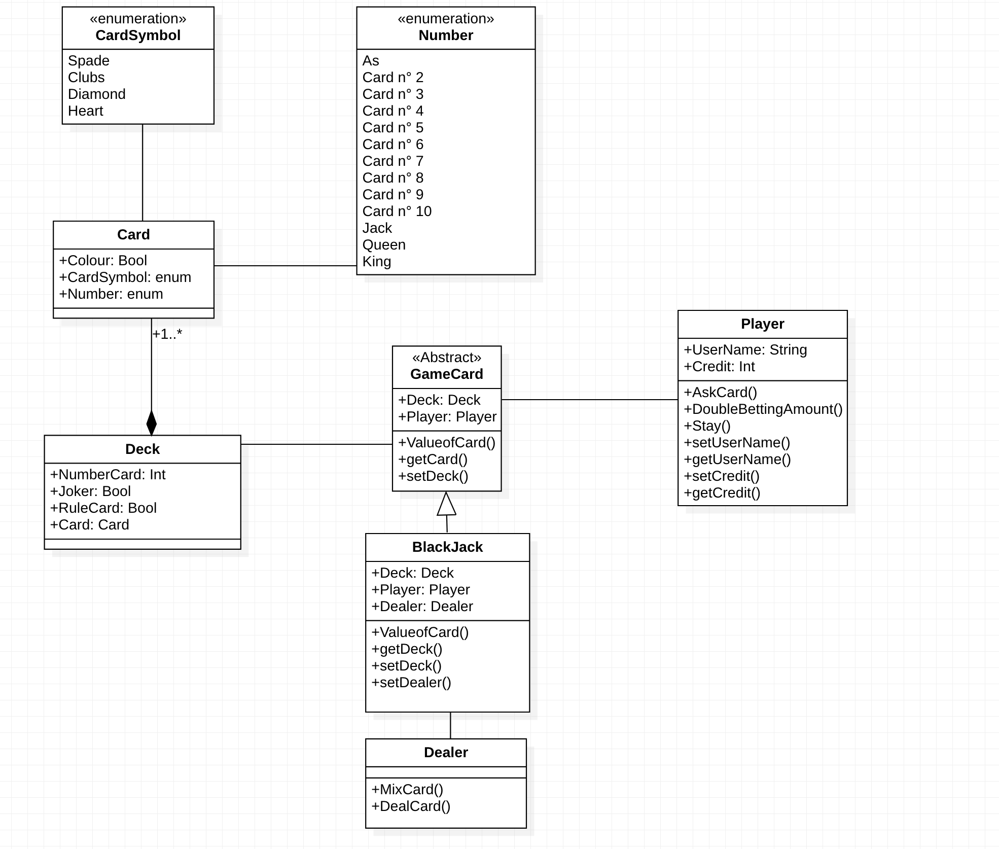

UML README 🚀
# Exo 1
Notre diagramme de class est composé de 5 class : 
- Card : Qui utilise des enumération : 
    - CardSymbols : Qui correspond au différents symboles que la "Card" peut avoir
    - Number : Qui correspond au différentes valeurs que la "Card" que la carte peut avoir

- Deck : Qui est composé de plusieurs "Card"
- GameCard : Nous permet de créer un jeu de carte génerique (des regles partagées par tout les jeux de cartes.) Game Card est en association avec "Player" ainsi que "Deck"
- BlackJack : Qui est en association avec "Dealer" et en héritage de GameCard
- Player : Qui effectue les opérations demandées
- Dealer : Qui effectue les opérations demandées

La Class "BlackJack" est la class principale, "BlackJack" utilise les autre class pour mettre en oeuvre le jeu

# Exo 2

Notre Diagramme de class est composé de 5 class:

- Client : Qui est en association avec "CenterCall"