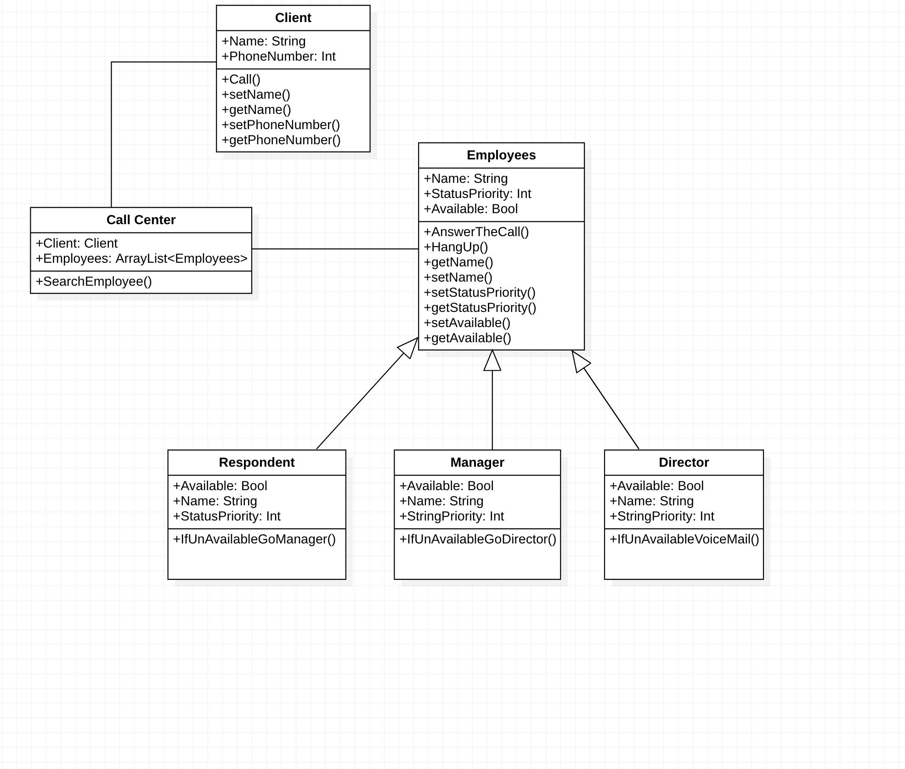
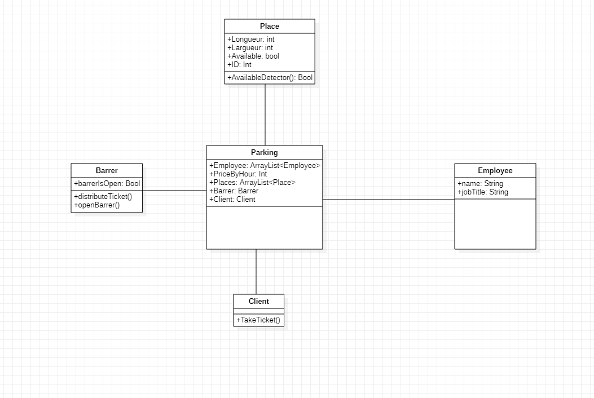
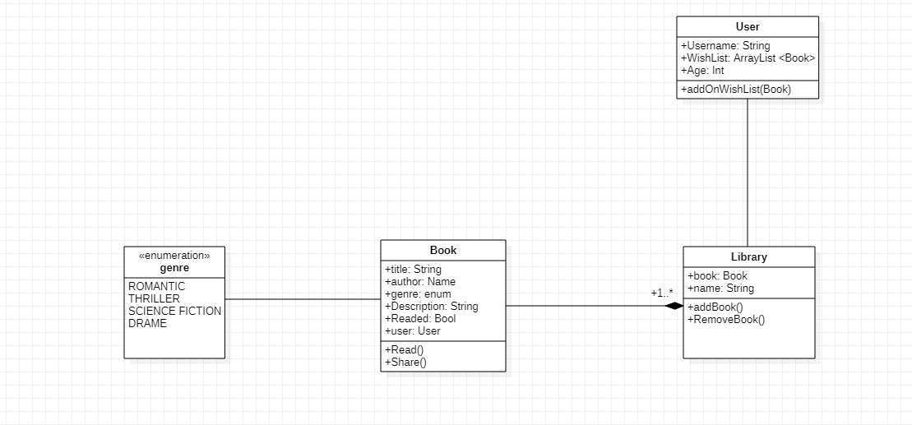

UML README 🚀
# Exo 1
Notre diagramme de class est composé de 5 class : 
- Card : Qui utilise des enumération : 

    - CardSymbols : Qui correspond au différents symboles que la "Card" peut avoir
    - Number : Qui correspond au différentes valeurs que la "Card" que la carte peut avoir

- Deck : Qui est composé de plusieurs "Card"

- GameCard : Nous permet de créer un jeu de carte universel (des regles partagées par tout les jeux de cartes) Game Card est en association avec "Player" ainsi que "Deck"
Puisque GameCard est une class abstraite, GetCardValue sera à redéfinir pour chaque dans chaque class fille afin d'attribuer la valeur pour chaque card du Deck

- BlackJack : Qui est en association avec "Dealer" et hérite de "GameCard"

- Player : Qui effectue les opérations demandées

- Dealer : Qui effectue les opérations demandées

La Class "GameCard" est la class principale, en héritant de "GameCard" , "BlackJack" utilise les autres class pour mettre en oeuvre le jeu.

# Exo 2

Notre Diagramme de class est composé de 5 class:

- Client : Qui est en association avec "Call Center"

- Call Center : Qui est en association avec la liste des Employés "Employees". La fonction "SearchEmployee()" cherche dans un premier temps un "Respondent" disponible (Available), dans le cas où celui-ci n'est pas disponible la fonction exécutera l'opération de la class "Respondent".

La fonction "IfUnAvailableGoManager()" cherche à son tour un "Manager" disponible, dans le cas où le Manager est également indisponible la fonction éxecutera l'opération de la class "Manager".

La fonction "IfUnAvailableGoDirector()" cherche à sont tour un "Director" disponible, dans le cas où le Directeur est également indisponible la fonction éxecutera l'opération de la class "Director"

La fonction "IfUnAvailableVoiceMail()" dirige le client vers une Boite Vocal.

- Employees : Nous permet d'accepter l'appel "AnswerTheCall()" en fonction du status de priorité "StatusPriority"

- Respondent : Nous permet d'executer la fonction "IfUnAvailableGoManager()" dans le cas où le "Respondent" n'est pas disponible (Available : false). "Respondent" hérite de la class "Employees"

- Manager : Nous permet d'excuter la fonction "IfUnAvailableGoDirector()" dans le cas où le "Manager" n'est pas disponible (Available : false). "Manager" hérite de la class "Employees"

- Director : Nous permet d'excuter la fonction "IfUnAvailableVoiceMail()" dans le cas où le "Director" n'est pas disponible (Available : false) . "Director" hérite de la class "Employees"

# Exo 4

Notre diagramme de class est composé de 4 class : 

- User qui permet à l'utisateur d'envoyé un message et qui possède un ID pour pouvoir l'authentifier ainsi qu'un username.

- Message qui correspond au message envoyé par l'user et qui possède donc un Propriétaire un destinaire et un corps.

- Postman est la classe qui permet de faire l'intermédiaire entre l'user et le server. 

- Server est une class qui recois une requête (un message) et qui renvoie une réponse adéquate. 

Nous avons utiliser un singleton pour la class Server puisque que nous souhaitons pas avoir plusieurs instance de Server mais récuperer plutot l'instance déjà effective grâce à la méthode getInstance().

# Exo 5

Notre diagramme de class est composé de 4 class : 

- Player qui permet à un user d'avoir un nom et de choisir un couleur (Noir ou Blanc)

- Piece qui correspond simplement à aux pièces utilisées lors d'une partie de Othello

- Board qui est composé d'un tableau à 2 dimensions de pièces afin de représenter un tableau d'Othello. Ses fonctions CheckMove(x,y) seront éxecuté lorsque l'user utilisera la fonction Play(x,y). Et il pourra afficher le tableau de la partie en cours.

- Othello Game est la class qui met en place la partie possèdant le nécessaire pour une partie d'Othello c'est à dire : des joueurs (Player) et un tableau composé de Piece (Board et Piece).

